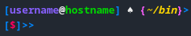

# My_bash_prompt_conf

# INSTALLATION:
You only copy & paste the next line in your " ~/.bashrc " file 

   PS1='\[\e[0;1;38;5;33m\][\[\e[0;1;38;5;99m\]\u\[\e[0;1;97m\]@\[\e[0;1;38;5;40m\]\h\[\e[0;1;38;5;33m\]] \[\e[0;1m\]♠️ \[\e[0;1;38;5;207m\]{\[\e[0;1;3;38;5;220m\]\w\[\e[0;1;38;5;207m\]}\[\e[0;1;38;5;33m\]>\n\[\e[0;1;38;5;33m\][\[\e[0;1;38;5;197m\]\$\[\e[0;1;38;5;33m\]]\[\e[0;1;38;5;33m\]>\[\e[0;1;38;5;33m\]> \[\e[0m\]'
   
# License: 
This bash prompt theme is licensed under GPLv3, for more details check LICENSE.
